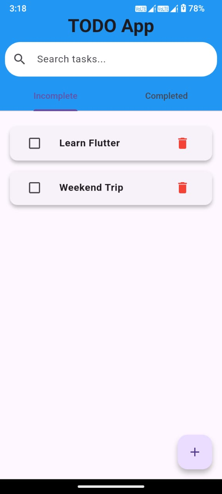
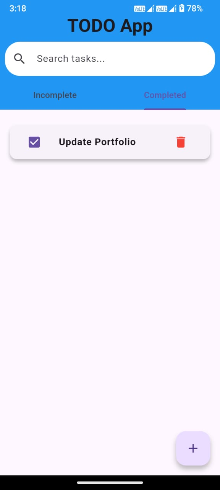
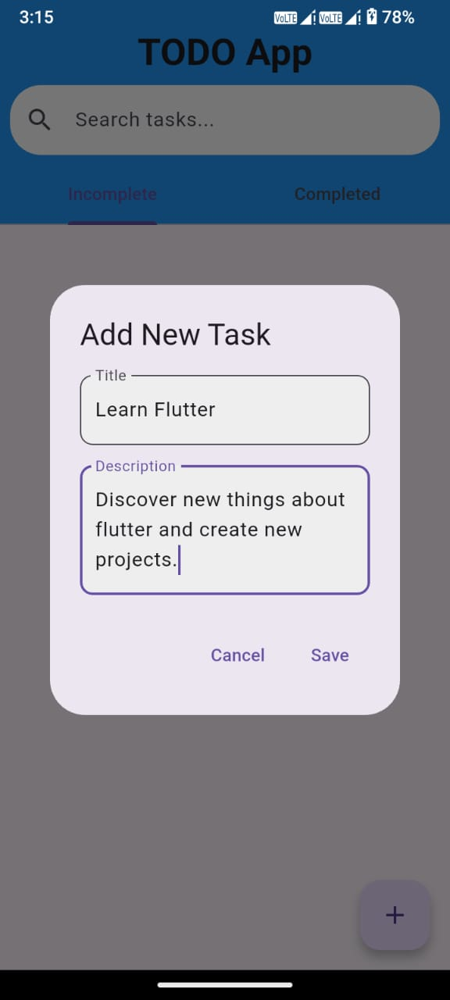
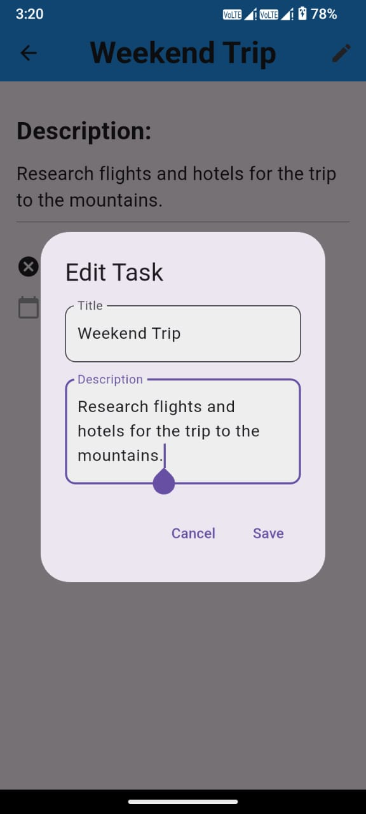
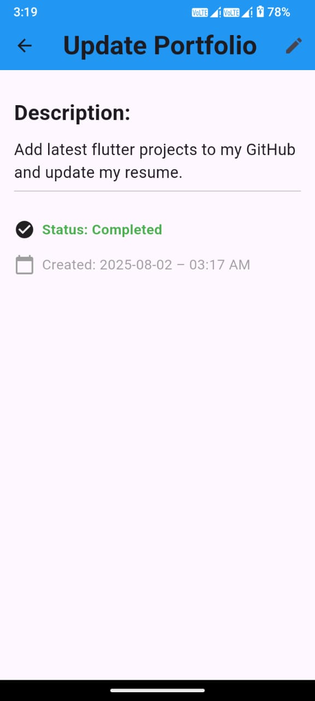
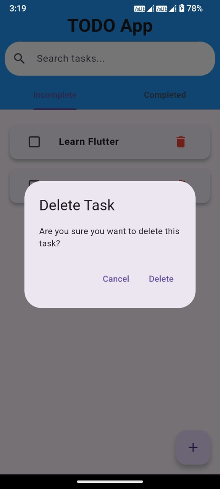
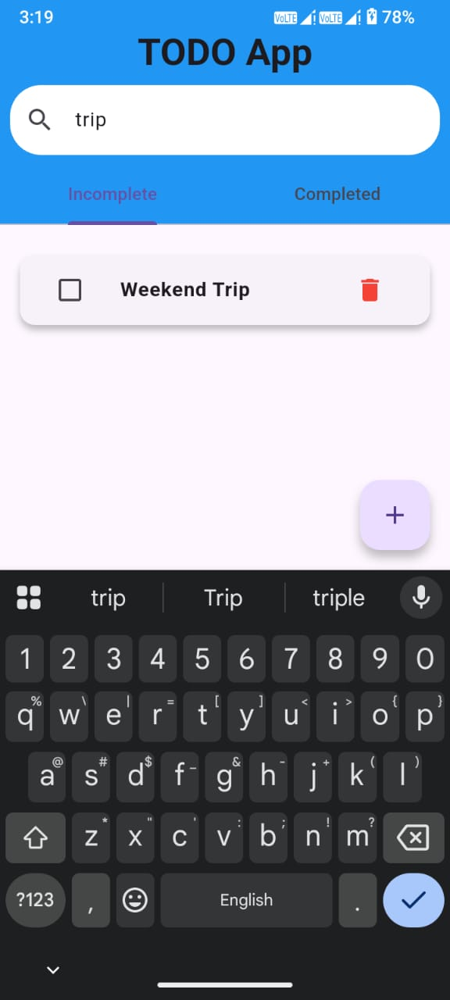

# TODO App

A clean and simple task management application built with Flutter. This project demonstrates core mobile development concepts such as local data persistence, dynamic UI updates, and navigation, providing a reliable tool for organizing your daily tasks.

## ✨ Features

* **Task Management**: Easily add, edit, and delete tasks with a title, description, and status.
* **Status Tabs**: Organize your tasks by their status with dedicated tabs for "Incomplete" and "Completed" tasks.
* **Detailed View**: Tap on any task to view its full details on a separate screen, which also includes an option to edit the task.
* **Data Persistence**: All tasks are stored securely in a local **SQLite** database, ensuring your data is saved across sessions.
* **Dynamic Search**: A real-time search bar allows you to filter tasks instantly by their title.
* **Intuitive UI**: A user-friendly interface with consistent design and clear visual feedback for all actions.

## 📸 Screenshots

| Home Screen (Incomplete Tasks) | Home Screen (Completed Tasks) | Add Task Dialog | Edit Task Dialog | Task Details Screen | Delete Task | Search Task |
| :----------------------------: | :---------------------------: | :-------------: | :--------------: | :-----------------: | :---------: | :---------: |
|  |  |  |  |  |  |  |